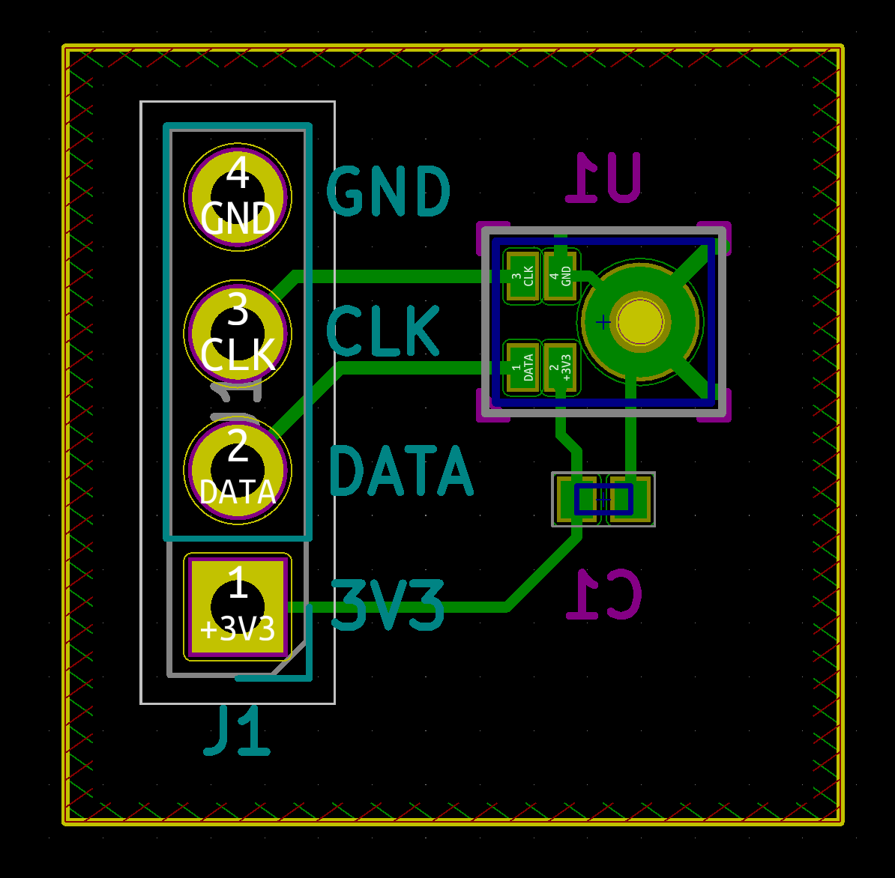
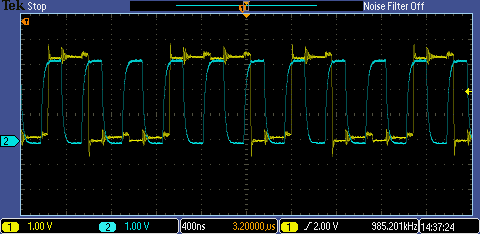

# SIMIC/MEMS magic

This is the Hardware related Software part of the Talk to Two project. As the name says, the goal is beeing able to talk to two people at the same time and as a subproject we're going to develope our own microphone array to realise this. The related Software including

- Verilog driver for the SIMIC (in progress)
- Communication module for ARM-Core and FPGA (not implemented yet)
- Python driver to access the audio data as Numpy array (far away from beeing even thought)

can be found in this subproject. For now everything is running on a Mojo V3. You'll obviously need one if you want to use the code from this repository, plus it's highly recommended to use **Ubuntu** since we only tried it on Ubuntu yet and through that are   not going to offer any support if you're trying it on some fruit or window related OS.

## Pre-requisites
- You're having a Mojo Version 3 with you
- succesfully installed the Xillinx stuff, described [here](https://embeddedmicro.com/pages/installing-ise)
- a fully installed [Mojo-Ide](https://embeddedmicro.com/pages/mojo-ide)
- and of course a microphone whos data you want to see (preferebly on a breakout board)

## How to build
### Build the binary
Open the `./mems/mems.mojo` file as a project in the Mojo-Ide to open up the project. To build it you need to press the "Build Project"-button, it has a hammer-icon. Once it's succesfully built, you need to upload it onto a mojo.

### Upload to Mojo
To upload it to the mojo, you need to connect one with a USB-cabel to your computer. The Ide should automaticly find the mojo, but you can check it nevertheless under `Settings->Serial Port...`. Under my Ubuntu it always showed me something like `/dev/ttyAMC0` but this could differ from computer to computer.
Once the Mojo is connected, you can press on one of the arrow Icons, for whether writing it temporarly(recommended) into it or to flash it. It's not necessary that you understand what that means for now, nevertheless both will lead the mojo to do what we want from it.

## How to test
Right now we're not getting a audio signal that we could test by hearing it or something like that, **but** you can test the PDM Signal that is coming out of the microphone by using an Osciloscope. If you don't know how to use an osci, you can whether ask me [(Kevin)](kevinjust87@gmail.com), Simon, Luis or anybody that has fortunately some experience with using an osci ;) . Before we're going to connect the pins, the Mojo pins are fortunately labeled on the Mojo itself. For the breakout board you can lookup onto this figure from the pcb

  

The pins that you will need to connect to see cool stuff:

**Mojo -> board**

    GND -> GND
    +V  -> +3V3
    Pin 26 -> CLK

As you might have noticed, the mic has a 4th still free pin, the DATA pin. This one you do analyze with the osci to see the ultimate fancy PDM Signal. What you should see now is something like the yellow signal from this osci screenshot

## How to use
Right now there is no real usage of the current state. But basically you're just doing the same as you do when you test it ;) .
