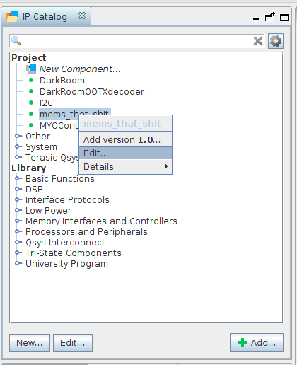
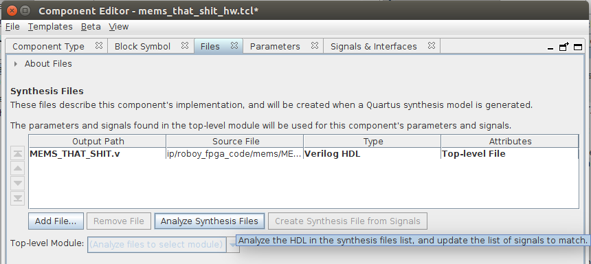
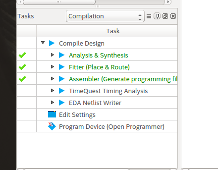
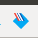
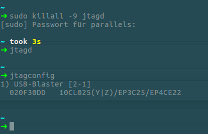
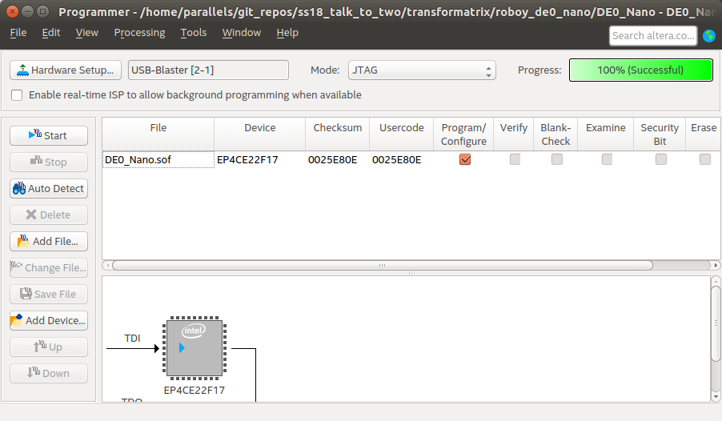
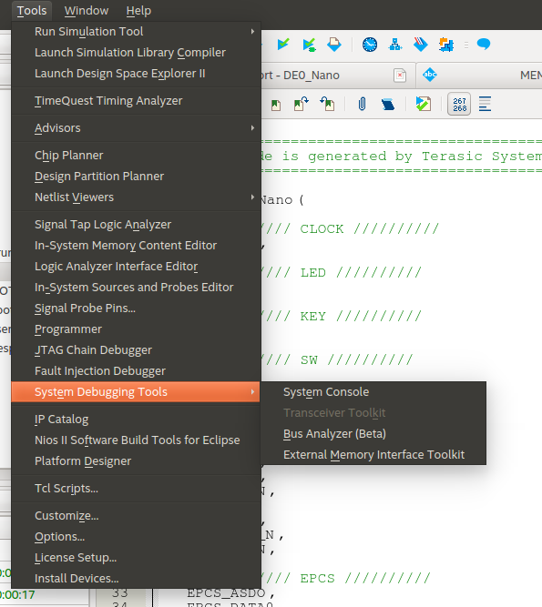

# SIMIC/MEMS magic

This is the Hardware related Software part of the Talk to Two project. As the name says, the goal is beeing able to talk to two people at the same time and as a subproject we're going to develop our own microphone array to realize this. The related Software including

- Verilog driver for the SIMIC (solved)
- Communication module for ARM-Core and FPGA (solved)
- Python driver to access the audio data as Numpy array (far far away)
- the Lowpass filter and decimation implementation and algorithm in Matlab (solved)

can be found in this subproject. For now everything that is related to a FPGA is running on a [DE0-Nano](https://www.terasic.com.tw/cgi-bin/page/archive.pl?No=593). You'll obviously need one if you want to use the code from this repository, plus it's highly recommended to use **Ubuntu** for programming it since we only tried it on Ubuntu yet. Through that we are not going to offer any support if you're trying it on some fruit or window related OS.
The second part will care about Matlab and there you'll just need a working Matlab in at least the 2016b Version.

## Doing FPGA
### Pre-requisites
- You're having a DE0-Nano with you
- You have [Quartus Prime Lite](http://fpgasoftware.intel.com/17.1/?edition=lite&platform=linux&download_manager=dlm3) installed
- and of course a microphone whoes data you want to see (prefarebly on a breakout board)

### How to develop
Open the project file DE0_Nano.qpf in quartus as a project. The main module we're using is MEMS_THAT_SHIT. The top module that is the basis of what is programmed onto the FPGA is DE0_Nano. If you're changing anything except for the MEMS_THAT_SHIT module, you're free to go to the next section **How to build**. If you changed something in the main module you will need to update its content in the Platform Designer, since we're using this Tool from Quartus to make our use of the memory module and so on easier. Do this by clicking on its icon in the task bar.

  

To progress you'll need to open mems_mic.qsys in the Platform Designer. Then right click onto mems_that_shit in the IP Catalog section on the upper left and execute `Edit...`.

  

Once the Component Editor is opened, switch to the `Files`tab and click on `Analyze Synthesis Files` to update the MEMS_THAT_SHIT content.

  

This will check MEMS_THAT_SHIT onto errors and warnings, you'll obviously need to solve them if there are warnings, befor you can progress.
If you changed something about the module interface, you'll also need to look at Signals & Interfaces, but if you're doing this I recommend to talk to me ([Kevin](kevinjust87@gmail.com)) or Simon. Afterwards you'll also going to need to `Generate HDL ...` in the lower right part of the main Platform Designer Window. Once this is done you can go back to the main Quartus Window and progress with **How to build**.

### How to build
Once you're in the main Quartus window you can build by double clicking onto the Assembler button in the Task Window on the lower left.

  

### How to programm the FPGA
Once it's build you can upload the the binary onto the de0 by using the programmer, you can open it by clicking the dedicated symbol in the task line

  

Now you need to make sure that your de0 is connected properly. For the connection we uthe JTAG bus. It is something that is served with the Quartus Prime Lite installation, and it's executable can be found under `/way/to/quartus_installation/intelFPGA_lite/17.1/quartus/bin`. In the next figure you can see a correct like output of my terminal.

  

In the special case of my Ubuntu I need to start jtagd with the user-start flag like

    sudo ~/intelFPGA_lite/17.1/quartus/bin/jtagd --user-start

such that it works. You also need to start jtagconfig with sudo like

    sudo ~/intelFPGA_lite/17.1/quartus/bin/jtagconfig

Once the DE0-Nano is connected you can upload the program via the programmer.

  

You will need to set the connection to the DE0 in Hardware Setup and afterwards start the programming by pressing Start ;).

### How to use
If you now want to see what is written into the RAM, you'll need to open the System console by choosing it in the `Tools` tab.

  

Once you're here you can execute a variaty of commands in the `Tcl Console`. We have a bunch of our typical commands plus describing comments provided in `transformatrix/roboy_de0_nano/read_onchip_ram.tcl`. If you wanna programm something onto the FPGA again, you'll need to close the System Console window, since it's blocking the JTAG Bus for it's communication.

## Lowpass Filter and Matlab
All our Matlab scripts plus data, that we tried some of our algorithms with, can be found in `transformatrix/matlab`. A short explanation of what is doing what

Script | Abstract
--- | ---
crazy_filter_magic | This is where the filter magic happened. If you execute it there will probably pop up a lot of graphs. But in the start of the script you'll see some variables that define which part of the script is executed.
PDM_to_analog2 | It's the low pass filter algorithm from the grandmaster Sausy. It was the foundation for the algorithms in **crazy_filter_magic**. If you want to learn more about that you should ask the grandmaster himself, he'll be pleased to explain you everything ;).
generate_test_data | A script used by PDM_to_analog2 to generate sample data.
window_resize | A script used to resize the window of the filter plot. This to scroll instantly to our point of interest.

## The End
If you're going to work with this, I hope you know a lot about signal processing, FPGA programming and what you're doing. Nevertheless, people that can may help are me ([Kevin](kevinjust87@gmail.com)), Simon or Luis from Roboy. Enjoy :)
